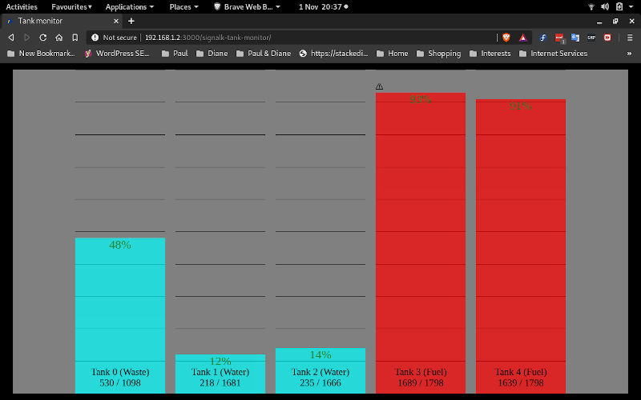

# signalk-tank-monitor

Display tank levels.

__signalk-tank-monitor__ implements a webapp for the [Signal K Node server](https://github.com/SignalK/signalk-server-node) that presents a simple bar-chart showing the levels of all tanks reported in Signal K.

The Signal K configuration interface can be used to modify the appearance of the generated display including by the addition of user-defined text and graphic alerts.



## Installation

Download and install __signalk-tank-monitor__ using the *Appstore* menu option in your Signal K Node server console. The plugin can also be obtained from the [project homepage](https://github.com/preeve9534/signalk-tank-monitor) and installed using [these instructions](https://github.com/SignalK/signalk-server-node/blob/master/SERVERPLUGINS.md).

## Using the plugin

The plugin is enabled by default and after installation you should be able to immediately view available tank data by selecting *Signalk-Tank-Monitor* in your host server's *Webapps* interface.

## Configuration

The behaviour of __signalk-tank-monitor__ and the appearance of the generated web page can be adjusted using the configuration interface at *Server->Plugin Config->Tank monitor*.

Configuration involves specifying one or more *tweaks*. Each tweak is characterised by the following properties, all of which
are optional.

__path__\
This string identifies the scope of application of the properties
defined within the containing tweak and should consist of a tank path
prefix.
If no __path__ is specified, then the tweak will apply to all tank
paths (equivalent to specifying the value "tanks."), otherwise the
tweak will only apply to those tank paths that begin with the supplied
value.
Properties defined in a tweak with a specific __path__ value override
any that may have been defined in tweaks with a more general __path__
value.
Example: restrict this tweak to just tanks containg waste:
```
{ "path": "tanks.wasteWater.", ..... }
```

__ignore__\
This boolean property specifies whether or not tank data from sources
selected by __path__ should be ignored or not.
Example: ignore data from fuel tank two:
```
{ "path": "tanks.fuel.2.", "ignore": true }
```

__name__\
This string property introduces a text string that will be used to
label tank data from sources selected by __path__.
If name is omitted then its value will default to the value of the
token used by Signal K as the second element of a tank path.
Example: change the display name for waste tanks from "wasteWater"
to "Waste":
```
{ "path": "tanks.wasteWater.", "name": "Waste" }
```
 
__color__\
This string property introduces a text string that will be used to
specify the colour used for the display of tank data from sources
selected by __path__.
Example: display fuel data in red:
```
{ "path": "tanks.fuel.", "color": "red" }
```

__factor__\
This decimal property specifies a scaling factor that will be used to
adjust tank data received from sources selected by __path__.
Example: convert all tank data from cubic metres to gallons:
```
{ "factor": 264.172 }
```

__places__\
This integer property specifies the number of decimal places that
should be used for diaplaying tank data from sources selected by
__path__.
Example: display tank data with no decimal part.
```
{ "places": 0 }
```

__labels__\
Decorate this __path__ with some text or iconography, perhaps
conditionally.
Each entry in the __labels__ array defines a *label* which will be
displayed at the top of the data region associated with __path__.
There are two properies for each label definition.

__content__\
Specifies some text or the name of an SVG icon file which will form
the displayed element.

__trigger__\
Is optional: if present, __label__ is only displayed when the trigger
value is true; if absent, the the __label__ is displayed continuously.
There are a number of possibilities for __trigger__:

*path*\
*path*[__<__*value*]\
*path*[__>__*value*]\
*notification_path*[__!__*state*]

## Debugging and logging

The plugin understands the following debug keys.

| Key | Meaning                                                                                                   |
|:-------------------|:-------------------------------------------------------------------------------------------|
| switchbank:\*      | Enable all keys.                                                                           | 
| switchbank:actions | Log each output action taken by the plugin.                                                |
| switchbank:rules   | Log each rule loaded by the plugin and indicate whether it was successfully parsed or not. |

## Author

Paul Reeve <preeve@pdjr.eu>\
October 2020
<!--stackedit_data:
eyJoaXN0b3J5IjpbOTEwMzEyNjc0XX0=
-->