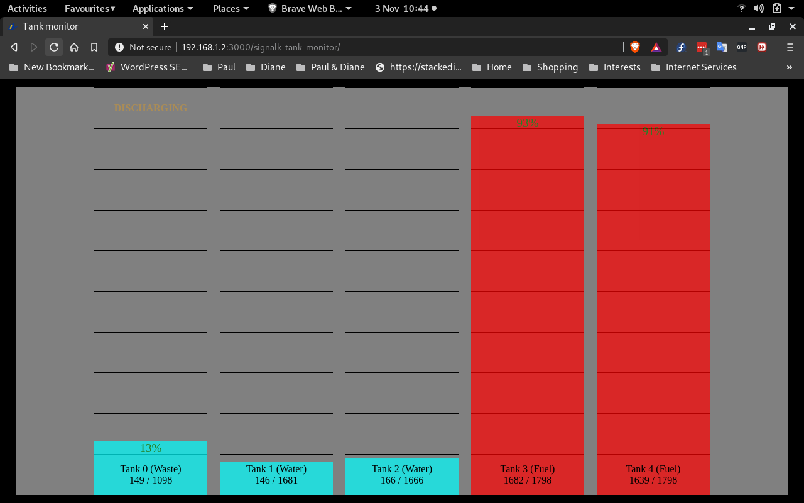

# signalk-tank-monitor

Display tank levels.

__signalk-tank-monitor__ implements a webapp for the [Signal K Node server](https://github.com/SignalK/signalk-server-node) that presents a simple bar-chart showing the levels of all tanks reported in Signal K.

The Signal K configuration interface can be used to modify the appearance of the generated display including by the addition of user-defined text and graphic alerts.



## Installation

Download and install __signalk-tank-monitor__ using the *Appstore* menu option in your Signal K Node server console. The plugin can also be obtained from the [project homepage](https://github.com/preeve9534/signalk-tank-monitor) and installed using [these instructions](https://github.com/SignalK/signalk-server-node/blob/master/SERVERPLUGINS.md).

## Using the plugin

The plugin is enabled by default and after installation you should be able to immediately view available tank data by selecting *Signalk-Tank-Monitor* in your host server's *Webapps* interface.

## Configuration

The behaviour of __signalk-tank-monitor__ and the appearance of the generated web page can be adjusted using the configuration interface at *Server->Plugin Config->Tank monitor*.

Configuration involves specifying one or more *tweaks*. Each tweak is characterised by the following properties, all of which are optional.

__path__\
This string identifies the scope of application of the properties defined within the containing tweak and should consist of a tank path prefix. If no __path__ is specified, then the tweak will apply to all tank paths (equivalent to specifying the value "tanks."), otherwise the tweak will only apply to those tank paths that begin with the supplied value. Properties defined in a tweak with a specific __path__ value override any that may have been defined in tweaks with a more general __path__ value.

Example: restrict this tweak to just tanks containg waste:
```
{ "path": "tanks.wasteWater.", ..... }
```

__ignore__\
This boolean property specifies whether or not tank data from sources selected by __path__ should be ignored or not.

Example: ignore data from fuel tank two:
```
{ "path": "tanks.fuel.2.", "ignore": true }
```

__name__\
This string property introduces a text string that will be used to label tank data from sources selected by __path__. If name is omitted then its value will default to the value of the token used by Signal K as the second element of a tank path.

Example: change the display name for waste tanks from "wasteWater" to "Waste":
```
{ "path": "tanks.wasteWater.", "name": "Waste" }
```
 
__color__\
This string property introduces a text string that will be used to specify the colour used for the display of tank data from sources selected by __path__.

Example: display fuel data in red:
```
{ "path": "tanks.fuel.", "color": "red" }
```

__factor__\
This decimal property specifies a scaling factor that will be used to adjust tank data received from sources selected by __path__.

Example: convert all tank data from cubic metres to gallons:
```
{ "factor": 264.172 }
```

__places__\
This integer property specifies the number of decimal places that should be used for displaying tank data from sources selected by __path__.

Example: display tank data with no decimal part.
```
{ "places": 0 }
```

__labels__\
This array property gathers together a collection of label definitions. Each label definition supplies some text or iconography which will be used to decorate the data source selected by __path__ and defines whether or not the label should be displayed permanently or only when some trigger condition is met.

Each label definition may include the following properties.

__content__\
This string property specifies some text or the name of an SVG icon file which will form the displayed element.

__trigger__\
If present, then this string property supplies a trigger condition which must evaluate to true for label __content__  to be displayed.

A trigger condition is always formed from a Signal K path and some implied or explicit condition that path values will be tested against.  There are several possible styles of trigger condition.

*path* - use the value returned by *path* as-is: so, if *path* returns a non-zero value then __content__ will be displayed.
 
*path*__<__*value* - only display __content__ if the value returned from *path* is less than *value*.

*path*__>__*value* - only display __content__ if the value returned from *path* is greater than *value*.

*notification_path* - only display __content__  if there is an active  notification on *notification-path*.

*notification-path*__:__*state* - only display __content__  if there is an active  notification on *notification-path* and its state property is equal to *state*.

## Author

Paul Reeve <preeve@pdjr.eu>\
November 2020
<!--stackedit_data:
eyJoaXN0b3J5IjpbLTMxODMwODgzLC01Mzk0ODY5MjJdfQ==
-->